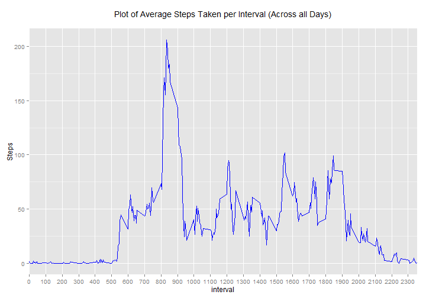

Reproducible Research: Peer Assessment 1
======================================================

<br>

## Loading and preprocessing the data


```r
library(ggplot2)                                # load libraries used in this assignment
library(dplyr)

data <- read.csv("activity.csv")                # read the data
data <- tbl_df(data)                            # convert to dplyr data frame
```

<br>

## What is mean total number of steps taken per day?

First, plot a histogram of the data


```r
dailySum <- group_by(data, date)                          # group data by date
dailySum <- summarize(dailySum, Steps = sum(steps))       # sum by date

h <- ggplot(dailySum, aes(x=Steps)) + 
        geom_histogram(fill = "skyblue", color = "darkgray") +
        labs(title = "Histogram of Total Daily Steps\n")

print(h)
```

 

Next, calculate the Mean and Median of Total Daily Steps


```r
sMean <- round(mean(dailySum$Steps, na.rm=T), 2)        # round to 2 decimal places
sMedian <- median(dailySum$Steps, na.rm=T)
```

#### Mean = 10766.19  
#### Median = 10765

<br>

## What is the average daily activity pattern?

First, create a time series plot of the 5-minute intervals and the average number of steps
taken (averaged across all days)


```r
avgIntv <- group_by(data, interval)                             # group data by interval
avgIntv <- summarize(avgIntv, Steps = mean(steps, na.rm=T))     # average by interval

tsPlot <- ggplot(avgIntv, aes(x=interval, y=Steps)) + 
        geom_line(aes(size=1), color = "skyblue") +
        labs(title = "Plot of Average Steps Taken per Interval (Across all Days)\n") +
        scale_x_discrete(breaks=seq(0, 2400, by=100))

print(tsPlot)
```

 

<br>

## Imputing missing values


<br>

## Are there differences in activity patterns between weekdays and weekends?
